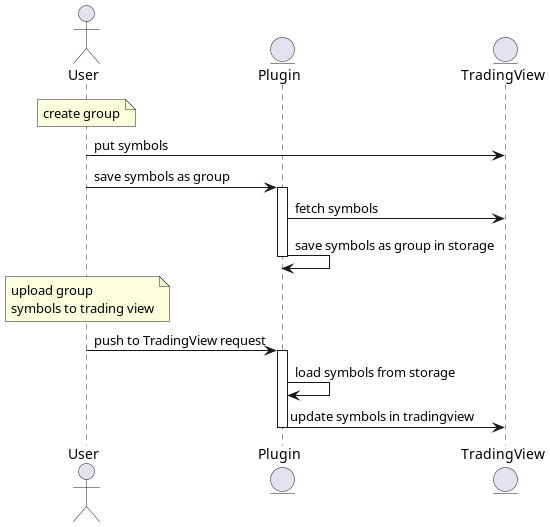

Plugin allow bypass tradingview restriction to hava limited number of watchlist symbols. 
It's bypass by keep symbols as group in plugin and push chosen group to tradingview.

### How it works?



### Install cmdrequest
All work on linux and firefox.

cmdrequest.py is required to remove browser http request limitations.
```bash
./install_cmdrequest.sh
```

### Running in development mode
In Firefox: Open the about:debugging page, click the This Firefox option, click the Load Temporary Add-on button, then select any file in your extension's directory.
or
about:debugging#/runtime/this-firefox

### Build, sign and create installable package. 
In package.json in config section change api ISSUER and SECRET for your own.
```javascript
"config": {
    "AMO_JWT_ISSUER": "XXX",
    "AMO_JWT_SECRET": "XXX"
},
```
Build and sign
```bash
npm run build
```
